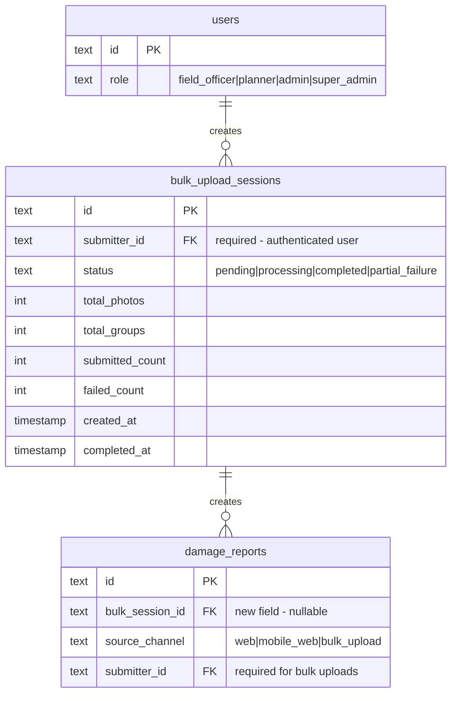

# feat: Bulk Photo Upload with GPS-Based Incident Grouping

## Overview

Add support for authorized field officers and above to upload existing photos in bulk within the "Report Incident" functionality. The system will extract GPS metadata from photos and automatically group photos by location proximity to create separate incidents. This feature is designed for field officers in areas with intermittent or no internet connectivity who want to upload photos taken offline.

## Constraints

- **Access Control**: Only authenticated users with `field_officer`, `planner`, `admin`, or `super_admin` role
- **Mobile-First Design**: UI optimized for mobile devices (thumb-friendly touch targets, single-column layouts, swipe gestures)
- **No Anonymous Access**: Requires authentication to access bulk upload feature

## Problem Statement / Motivation

**Current Limitation**: Users can only capture photos in real-time using the camera interface. They cannot upload existing photos from their device gallery.

**User Need**: Field officers often take photos of road damage in areas with no internet. They need a way to:
1. Upload these photos later when connectivity is available
2. Have the system automatically organize photos by location
3. Submit multiple incident reports efficiently without repetitive data entry

**Business Value**:
- Increases incident reporting coverage in remote/rural areas
- Reduces friction for field officer surveys (e.g., after inspecting a road segment)
- Better data quality through automated GPS-based grouping
- Controlled access ensures data quality from verified submitters

## Proposed Solution

A new bulk upload mode accessible from the main menu (for authorized roles) that:
1. Requires authentication with `field_officer` role or higher
2. Accepts multiple image files from device storage (mobile-first file picker)
3. Extracts GPS coordinates from EXIF metadata using the `exifr` library
4. Groups photos by geographic proximity (50m radius using Haversine distance)
5. Presents a mobile-friendly review interface for users to confirm/edit groupings
6. Creates separate incident reports for each location group
7. Supports offline queueing for later submission

## Technical Approach

### Architecture

```
┌─────────────────────────────────────────────────────────────────┐
│                        Frontend (React)                         │
├─────────────────────────────────────────────────────────────────┤
│  BulkUploadPage                                                 │
│  ├── FileDropZone (react-dropzone)                             │
│  ├── PhotoProcessor (exifr for GPS extraction)                 │
│  ├── LocationGrouper (Haversine clustering)                    │
│  ├── GroupReviewPanel (editable groups)                        │
│  └── BulkSubmitHandler (sequential upload)                     │
├─────────────────────────────────────────────────────────────────┤
│                     State (Zustand Store)                       │
│  └── bulkUploadStore.ts (photos, groups, progress, queue)      │
├─────────────────────────────────────────────────────────────────┤
│                   Offline Storage (IndexedDB)                   │
│  └── Pending uploads with photos + metadata                     │
└─────────────────────────────────────────────────────────────────┘
                              │
                              ▼
┌─────────────────────────────────────────────────────────────────┐
│                     Backend (Hono + CF Workers)                 │
├─────────────────────────────────────────────────────────────────┤
│  POST /api/v1/upload/photos (existing - reused)                │
│  POST /api/v1/reports (existing - with sourceChannel)          │
│  POST /api/v1/reports/bulk (new - batch creation)              │
└─────────────────────────────────────────────────────────────────┘
                              │
                              ▼
┌─────────────────────────────────────────────────────────────────┐
│              Storage (Cloudflare R2 + D1 SQLite)               │
├─────────────────────────────────────────────────────────────────┤
│  R2: reports/pending/{uuid}.jpg                                 │
│  D1: damage_reports (sourceChannel='bulk_upload')              │
│  D1: media_attachments                                          │
│  D1: bulk_upload_sessions (new table)                          │
└─────────────────────────────────────────────────────────────────┘
```

### Data Model Changes



**Note**: No anonymous fields - bulk upload requires authentication with `field_officer` role or higher.

### Implementation Phases

#### Phase 1: Core Photo Selection & EXIF Extraction

**New Files:**
```
src/react-app/
├── components/
│   └── bulk-upload/
│       ├── FileDropZone.tsx        # Drag-drop + file input
│       ├── PhotoProcessor.tsx      # EXIF extraction wrapper
│       └── PhotoPreviewGrid.tsx    # Thumbnails with GPS indicators
├── hooks/
│   └── useExifExtraction.ts        # exifr wrapper hook
└── lib/
    └── exif-utils.ts               # GPS extraction utilities
```

**Tasks:**
- [ ] Install `exifr` package for EXIF extraction
- [ ] Create `FileDropZone` component using `react-dropzone`
- [ ] Implement `useExifExtraction` hook with batch processing
- [ ] Handle photos without GPS data gracefully
- [ ] Create preview grid with GPS status indicators
- [ ] Add file validation (type, size, count limits)

**Key Code - exif-utils.ts:**
```typescript
import exifr from 'exifr';

export interface PhotoWithMetadata {
  id: string;
  file: File;
  preview: string;
  gps: { latitude: number; longitude: number } | null;
  timestamp: Date | null;
  orientation: number | null;
}

export async function extractPhotoMetadata(file: File): Promise<PhotoWithMetadata> {
  const id = crypto.randomUUID();
  const preview = URL.createObjectURL(file);

  try {
    const [gpsData, exifData] = await Promise.all([
      exifr.gps(file).catch(() => null),
      exifr.parse(file, {
        pick: ['DateTimeOriginal', 'CreateDate', 'Orientation']
      }).catch(() => null)
    ]);

    return {
      id,
      file,
      preview,
      gps: gpsData ? { latitude: gpsData.latitude, longitude: gpsData.longitude } : null,
      timestamp: exifData?.DateTimeOriginal || exifData?.CreateDate || null,
      orientation: exifData?.Orientation || null
    };
  } catch (error) {
    console.error('EXIF extraction failed:', error);
    return { id, file, preview, gps: null, timestamp: null, orientation: null };
  }
}

export async function extractBatch(files: File[], onProgress?: (pct: number) => void): Promise<PhotoWithMetadata[]> {
  const results: PhotoWithMetadata[] = [];
  const batchSize = 10;

  for (let i = 0; i < files.length; i += batchSize) {
    const batch = files.slice(i, i + batchSize);
    const batchResults = await Promise.all(batch.map(extractPhotoMetadata));
    results.push(...batchResults);

    onProgress?.((i + batch.length) / files.length * 100);

    // Allow browser to breathe between batches
    await new Promise(resolve => setTimeout(resolve, 0));
  }

  return results;
}
```

#### Phase 2: Location Grouping Algorithm

**New Files:**
```
src/react-app/lib/
└── location-grouping.ts    # Haversine + clustering logic
```

**Tasks:**
- [ ] Implement Haversine distance calculation
- [ ] Create location grouping algorithm (50m radius)
- [ ] Handle edge cases (chain of photos, exact duplicates)
- [ ] Enforce 5-photo-per-incident limit with auto-splitting
- [ ] Support manual group adjustment
- [ ] Integrate with existing `findProvinceByCoords()` for province detection

**Key Code - location-grouping.ts:**
```typescript
import { PhotoWithMetadata } from './exif-utils';

const GROUPING_RADIUS_METERS = 50;
const MAX_PHOTOS_PER_INCIDENT = 5;

export interface LocationGroup {
  id: string;
  photos: PhotoWithMetadata[];
  centroid: { latitude: number; longitude: number };
  province?: string;
  district?: string;
}

function haversineDistance(
  coord1: { latitude: number; longitude: number },
  coord2: { latitude: number; longitude: number }
): number {
  const R = 6371000; // Earth's radius in meters
  const lat1 = coord1.latitude * Math.PI / 180;
  const lat2 = coord2.latitude * Math.PI / 180;
  const dLat = (coord2.latitude - coord1.latitude) * Math.PI / 180;
  const dLon = (coord2.longitude - coord1.longitude) * Math.PI / 180;

  const a = Math.sin(dLat/2) * Math.sin(dLat/2) +
    Math.cos(lat1) * Math.cos(lat2) * Math.sin(dLon/2) * Math.sin(dLon/2);
  const c = 2 * Math.atan2(Math.sqrt(a), Math.sqrt(1-a));

  return R * c;
}

function calculateCentroid(photos: PhotoWithMetadata[]): { latitude: number; longitude: number } {
  const withGps = photos.filter(p => p.gps);
  if (withGps.length === 0) return { latitude: 0, longitude: 0 };

  const sum = withGps.reduce(
    (acc, p) => ({ lat: acc.lat + p.gps!.latitude, lng: acc.lng + p.gps!.longitude }),
    { lat: 0, lng: 0 }
  );

  return { latitude: sum.lat / withGps.length, longitude: sum.lng / withGps.length };
}

export function groupPhotosByLocation(photos: PhotoWithMetadata[]): {
  groups: LocationGroup[];
  orphaned: PhotoWithMetadata[];
} {
  const withGps = photos.filter(p => p.gps !== null);
  const orphaned = photos.filter(p => p.gps === null);
  const processed = new Set<string>();
  const rawGroups: PhotoWithMetadata[][] = [];

  // Cluster by proximity
  for (const photo of withGps) {
    if (processed.has(photo.id)) continue;

    const group = [photo];
    processed.add(photo.id);

    for (const other of withGps) {
      if (processed.has(other.id)) continue;

      const distance = haversineDistance(photo.gps!, other.gps!);
      if (distance <= GROUPING_RADIUS_METERS) {
        group.push(other);
        processed.add(other.id);
      }
    }

    rawGroups.push(group);
  }

  // Split groups exceeding MAX_PHOTOS_PER_INCIDENT
  const groups: LocationGroup[] = [];
  for (const rawGroup of rawGroups) {
    // Sort by timestamp for consistent splitting
    const sorted = [...rawGroup].sort((a, b) =>
      (a.timestamp?.getTime() || 0) - (b.timestamp?.getTime() || 0)
    );

    for (let i = 0; i < sorted.length; i += MAX_PHOTOS_PER_INCIDENT) {
      const chunk = sorted.slice(i, i + MAX_PHOTOS_PER_INCIDENT);
      groups.push({
        id: crypto.randomUUID(),
        photos: chunk,
        centroid: calculateCentroid(chunk)
      });
    }
  }

  return { groups, orphaned };
}
```

#### Phase 3: Review & Edit Interface

**New Files:**
```
src/react-app/
├── pages/
│   └── BulkUpload.tsx              # Main bulk upload page (mobile-first)
├── components/
│   └── bulk-upload/
│       ├── GroupReviewCard.tsx     # Individual group display (touch-friendly)
│       ├── GroupEditor.tsx         # Edit group details (mobile form)
│       ├── OrphanedPhotosPanel.tsx # Photos without GPS (map picker)
│       └── ProgressSummary.tsx     # Completion tracker (sticky header)
└── stores/
    └── bulkUpload.ts               # Zustand store for bulk state
```

**Tasks:**
- [ ] Create `BulkUpload` page with mobile-first multi-step flow
- [ ] Build `GroupReviewCard` with large photo thumbnails and swipe navigation
- [ ] Implement `GroupEditor` for incident details per group (mobile form)
- [ ] Create `OrphanedPhotosPanel` for manual location assignment via map picker
- [ ] Build `ProgressSummary` component with sticky header progress indicator
- [ ] Add tap-to-move photo reassignment between groups (mobile-friendly)
- [ ] Implement draft saving to localStorage

**Key Code - bulkUpload.ts (Zustand Store):**
```typescript
import { create } from 'zustand';
import { persist } from 'zustand/middleware';
import { PhotoWithMetadata, LocationGroup } from '../lib/exif-utils';

interface BulkIncident {
  groupId: string;
  photos: PhotoWithMetadata[];
  centroid: { latitude: number; longitude: number };
  province: string | null;
  district: string | null;
  locationName: string;
  damageType: string | null;
  passabilityLevel: string | null;
  isSingleLane: boolean;
  blockedDistanceMeters: number | null;
  description: string;
  isComplete: boolean;
}

interface BulkUploadState {
  // Session
  sessionId: string | null;

  // Photos
  allPhotos: PhotoWithMetadata[];
  orphanedPhotos: PhotoWithMetadata[];

  // Groups/Incidents
  incidents: BulkIncident[];
  currentIncidentIndex: number;

  // Progress
  isProcessing: boolean;
  isSubmitting: boolean;
  uploadProgress: Record<string, number>;
  submitErrors: Record<string, string>;

  // Actions
  addPhotos: (photos: PhotoWithMetadata[]) => void;
  setGroups: (groups: LocationGroup[], orphaned: PhotoWithMetadata[]) => void;
  movePhotoToGroup: (photoId: string, targetGroupId: string) => void;
  updateIncident: (groupId: string, data: Partial<BulkIncident>) => void;
  setCurrentIndex: (index: number) => void;
  reset: () => void;
}

// Note: No anonymous contact info - user info comes from auth session
export const useBulkUploadStore = create<BulkUploadState>()(
  persist(
    (set, get) => ({
      // Initial state
      sessionId: null,
      allPhotos: [],
      orphanedPhotos: [],
      incidents: [],
      currentIncidentIndex: 0,
      isProcessing: false,
      isSubmitting: false,
      uploadProgress: {},
      submitErrors: {},

      // Actions
      addPhotos: (photos) => set((state) => ({
        allPhotos: [...state.allPhotos, ...photos]
      })),

      setGroups: (groups, orphaned) => set({
        incidents: groups.map(g => ({
          groupId: g.id,
          photos: g.photos,
          centroid: g.centroid,
          province: null,
          district: null,
          locationName: '',
          damageType: null,
          passabilityLevel: null,
          isSingleLane: false,
          blockedDistanceMeters: null,
          description: '',
          isComplete: false
        })),
        orphanedPhotos: orphaned
      }),

      movePhotoToGroup: (photoId, targetGroupId) => {
        // Implementation for tap-to-move regrouping (mobile-friendly)
      },

      updateIncident: (groupId, data) => set((state) => ({
        incidents: state.incidents.map(inc =>
          inc.groupId === groupId ? { ...inc, ...data } : inc
        )
      })),

      setCurrentIndex: (index) => set({ currentIncidentIndex: index }),

      reset: () => {
        const state = get();
        // Revoke object URLs to prevent memory leaks
        state.allPhotos.forEach(p => URL.revokeObjectURL(p.preview));
        state.orphanedPhotos.forEach(p => URL.revokeObjectURL(p.preview));

        set({
          sessionId: null,
          allPhotos: [],
          orphanedPhotos: [],
          incidents: [],
          currentIncidentIndex: 0,
          isProcessing: false,
          isSubmitting: false,
          uploadProgress: {},
          submitErrors: {}
        });
      }
    }),
    {
      name: 'bulk-upload-draft',
      partialize: (state) => ({
        // Only persist non-blob data
        incidents: state.incidents.map(inc => ({
          ...inc,
          photos: inc.photos.map(p => ({ id: p.id, gps: p.gps, timestamp: p.timestamp }))
        })),
        currentIncidentIndex: state.currentIncidentIndex
      })
    }
  )
);
```

**Key Code - BulkUpload.tsx (Route with Role Protection):**
```tsx
// In App.tsx - Add protected route for bulk upload
<Route
  path="/bulk-upload"
  element={
    <ProtectedRoute allowedRoles={["field_officer", "planner", "admin", "super_admin"]}>
      <BulkUpload />
    </ProtectedRoute>
  }
/>
```

#### Phase 4: Submission & Progress

**New Files:**
```
src/react-app/
├── components/
│   └── bulk-upload/
│       ├── SubmissionProgress.tsx  # Per-incident progress bars
│       └── SubmissionSummary.tsx   # Final results screen
├── hooks/
│   └── useBulkSubmission.ts        # Submission orchestration
└── lib/
    └── bulk-submit.ts              # API calls for bulk submission
```

**Tasks:**
- [ ] Implement sequential photo upload per incident group
- [ ] Create report for each group with `sourceChannel: 'bulk_upload'`
- [ ] Track upload progress per incident
- [ ] Handle partial failures with retry capability
- [ ] Show success/failure summary for all incidents
- [ ] Clear local storage on successful completion

**Key Code - bulk-submit.ts:**
```typescript
interface BulkSubmissionResult {
  groupId: string;
  success: boolean;
  reportId?: string;
  reportNumber?: string;
  error?: string;
}

// Note: No contactInfo param - authenticated user info is used server-side
export async function submitBulkIncidents(
  incidents: BulkIncident[],
  onProgress: (groupId: string, pct: number) => void
): Promise<BulkSubmissionResult[]> {
  const results: BulkSubmissionResult[] = [];

  for (const incident of incidents) {
    try {
      // Step 1: Upload photos
      const formData = new FormData();
      for (const photo of incident.photos) {
        formData.append('photos', photo.file);
      }

      const uploadResponse = await fetch('/api/v1/upload/photos', {
        method: 'POST',
        body: formData,
        credentials: 'include'  // Auth session cookie included
      });

      if (!uploadResponse.ok) {
        throw new Error('Photo upload failed');
      }

      const { keys } = await uploadResponse.json();
      onProgress(incident.groupId, 50);

      // Step 2: Create report (submitterId auto-set from auth session)
      const reportPayload = {
        latitude: incident.centroid.latitude,
        longitude: incident.centroid.longitude,
        provinceId: incident.province,
        districtId: incident.district,
        locationName: incident.locationName,
        damageType: incident.damageType,
        passabilityLevel: incident.passabilityLevel,
        isSingleLane: incident.isSingleLane,
        blockedDistanceMeters: incident.blockedDistanceMeters,
        description: incident.description,
        mediaKeys: keys,
        sourceChannel: 'bulk_upload',
        sourceType: 'field_officer'  // Always field_officer for bulk uploads
      };

      const reportResponse = await fetch('/api/v1/reports', {
        method: 'POST',
        headers: { 'Content-Type': 'application/json' },
        body: JSON.stringify(reportPayload),
        credentials: 'include'  // Auth session cookie included
      });

      if (!reportResponse.ok) {
        throw new Error('Report creation failed');
      }

      const report = await reportResponse.json();
      onProgress(incident.groupId, 100);

      results.push({
        groupId: incident.groupId,
        success: true,
        reportId: report.id,
        reportNumber: report.reportNumber
      });

    } catch (error) {
      results.push({
        groupId: incident.groupId,
        success: false,
        error: error instanceof Error ? error.message : 'Unknown error'
      });
    }
  }

  return results;
}
```

#### Phase 5: Offline Support (Optional Enhancement)

**New Files:**
```
src/react-app/
├── lib/
│   └── offline-queue.ts           # IndexedDB queue management
├── hooks/
│   └── useOfflineSync.ts          # Connectivity detection + sync
└── service-worker.ts              # Background sync registration
```

**Tasks:**
- [ ] Set up IndexedDB for storing photos + metadata offline
- [ ] Detect online/offline status
- [ ] Queue submissions when offline
- [ ] Sync pending queue when connectivity restored
- [ ] Show pending upload count in UI
- [ ] Add manual sync trigger button

## Acceptance Criteria

### Access Control Requirements

- [ ] Only authenticated users can access bulk upload feature
- [ ] Only users with `field_officer`, `planner`, `admin`, or `super_admin` role can access
- [ ] Redirect to login if unauthenticated user tries to access `/bulk-upload`
- [ ] Show "Access Denied" message for authenticated users without required role
- [ ] No anonymous contact info fields (user info comes from auth session)

### Functional Requirements

- [ ] User can select multiple photos from device gallery (max 50 photos)
- [ ] System extracts GPS coordinates from EXIF metadata
- [ ] Photos are grouped by 50m location proximity
- [ ] Groups with >5 photos are auto-split into multiple incidents
- [ ] User can review and edit groupings before submission
- [ ] User can tap/click to move photos between groups (mobile-friendly)
- [ ] Photos without GPS are shown in "unassigned" section
- [ ] User can manually assign location to orphaned photos via map picker
- [ ] Each group can have different incident details
- [ ] Progress is shown per-incident during submission
- [ ] Partial failures allow retrying failed incidents only
- [ ] Success screen shows report numbers for all created incidents
- [ ] Draft state is preserved in localStorage

### Mobile-First Design Requirements

- [ ] Single-column layout for all screens on mobile
- [ ] Touch targets minimum 44x44px (Apple HIG standard)
- [ ] Full-width buttons for primary actions
- [ ] Bottom-positioned action buttons (thumb zone)
- [ ] Swipe gestures for navigation between incident groups
- [ ] Native file picker for photo selection (`accept="image/*"`)
- [ ] Large photo thumbnails (minimum 80x80px)
- [ ] Sticky header with progress indicator
- [ ] Pull-to-refresh on review screen
- [ ] Haptic feedback on successful actions (if supported)
- [ ] Safe area padding for notched devices

### Non-Functional Requirements

- [ ] EXIF extraction completes within 5 seconds for 50 photos
- [ ] UI remains responsive during processing (no blocking)
- [ ] Photos preview at max 200x200px thumbnails
- [ ] Memory usage stays under 500MB for 50 photos
- [ ] Submission timeout extended to 5 minutes for large batches

### Quality Gates

- [ ] Unit tests for Haversine distance calculation
- [ ] Unit tests for grouping algorithm edge cases
- [ ] Integration tests for EXIF extraction
- [ ] E2E test for complete bulk upload flow
- [ ] Role-based access control tests
- [ ] Mobile responsiveness verified on iOS Safari + Android Chrome (primary)
- [ ] Tested on low-end Android devices (performance)

## Success Metrics

- Bulk upload adoption: % of incidents submitted via bulk_upload channel
- Completion rate: % of started bulk uploads that complete submission
- Average photos per session: How many photos users typically upload
- Average groups per session: How many incidents created per bulk upload
- Error rate: % of bulk submissions with partial failures

## Dependencies & Prerequisites

**New Package:**
- `exifr` (^7.1.3) - GPS/EXIF metadata extraction

**Existing Infrastructure:**
- POST /api/v1/upload/photos - Reused for photo upload
- POST /api/v1/reports - Reused for report creation
- R2 bucket - Photo storage
- D1 database - Report storage

**Optional:**
- `react-dropzone` - Enhanced drag-and-drop (can use native file input as fallback)
- `idb` - IndexedDB wrapper for offline storage

## Risk Analysis & Mitigation

| Risk | Impact | Mitigation |
|------|--------|------------|
| Browser memory exhaustion with many photos | High | Process in batches, use thumbnails for preview |
| EXIF library fails on certain image formats | Medium | Graceful fallback to "no GPS" status |
| Cloudflare Worker timeout for large submissions | Medium | Sequential submission with per-incident progress |
| User loses work on browser crash | High | Persist draft to localStorage after each action |
| GPS coordinates outside Sri Lanka | Low | Validate coordinates against province bounds |

## Future Considerations

- Server-side EXIF extraction for consistency
- AI-based photo quality assessment
- Duplicate incident detection across sessions
- Admin bulk review dashboard
- Push notifications for offline sync completion
- Integration with Linear for issue tracking

## References & Research

### Internal References
- Report Incident page: `src/react-app/pages/ReportIncident.tsx`
- Incident store: `src/react-app/stores/incidentReport.ts`
- Photo upload API: `src/worker/routes/upload.ts`
- Reports API: `src/worker/routes/reports.ts`
- Database schema: `src/worker/db/schema.ts`
- Location utilities: `src/react-app/data/sriLankaLocations.ts`

### External References
- [exifr Documentation](https://github.com/MikeKovarik/exifr)
- [react-dropzone API](https://react-dropzone.js.org/)
- [Haversine Formula](https://en.wikipedia.org/wiki/Haversine_formula)
- [IndexedDB Guide](https://web.dev/learn/pwa/offline-data/)
- [Background Sync API](https://developer.mozilla.org/en-US/docs/Web/API/Background_Synchronization_API)

---

*Plan created: 2025-12-05*
