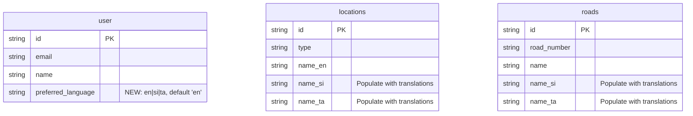

# feat: Internationalization (i18n) for Sinhala and Tamil

## Overview

Add multilingual support to the RDA Status application for three languages:
- **English (en)** - Default
- **Sinhala (si)** - Primary local language
- **Tamil (ta)** - Secondary local language

This includes translating all UI strings, road/location names, and integrating with Google Maps API for localized place names.

## Problem Statement / Motivation

The RDA Status application currently serves citizens across Sri Lanka, where:
- 74% speak Sinhala as their first language
- 18% speak Tamil as their first language
- Only ~10% are fluent in English

Without i18n support, the majority of users struggle to:
- Report road damage incidents accurately
- Understand damage type options and passability levels
- Navigate the application effectively
- Trust the system with official government communication

## Current State Analysis

### Database Ready (Partially)
- `locations` table has `name_si` and `name_ta` fields (currently NULL)
- `roads` table has `name_si` and `name_ta` fields (currently NULL)
- No `preferredLanguage` field on `user` table

### Frontend Strings (Hardcoded)
- ~8,200 lines of React components with embedded English text
- 9 provinces, 25 districts in `sriLankaLocations.ts` (English only)
- 9 damage types, 7 passability levels, 5 status labels (English only)

### Key Files Requiring Translation

| File | Location | Translation Items |
|------|----------|-------------------|
| `sriLankaLocations.ts` | `src/react-app/data/` | 9 provinces, 25 districts |
| `IncidentCategorySelect.tsx` | `src/react-app/components/forms/` | 9 damage types + descriptions |
| `PassabilityScale.tsx` | `src/react-app/components/forms/` | 7 passability levels |
| `ReportIncident.tsx` | `src/react-app/pages/` | ~50 form labels, buttons, messages |
| `Home.tsx` | `src/react-app/pages/` | Stats labels, navigation |
| `Header.tsx` | `src/react-app/components/layout/` | Navigation items, branding |
| `AdminReports.tsx` | `src/react-app/pages/` | Status labels, filters, actions |
| `constants.ts` | `src/shared/` | Severity labels, status labels |

---

## Proposed Solution

### Technology Stack

| Component | Choice | Rationale |
|-----------|--------|-----------|
| **i18n Library** | `react-i18next` | 6.3M+ weekly downloads, excellent hooks support, lazy loading, TypeScript integration |
| **Detection** | `i18next-browser-languagedetector` | Auto-detect from browser, persist to localStorage |
| **Backend Loading** | `i18next-http-backend` | Lazy-load translation files from `/locales/` |
| **Road Names** | Google Maps API + Manual | Use `language` parameter for reverse geocoding, manual translations for road registry |

### Translation File Structure

```
public/
  locales/
    en/
      common.json          # Buttons, labels, navigation
      report.json          # Report form strings
      admin.json           # Admin panel strings
      errors.json          # Error & validation messages
      locations.json       # Province/district names
    si/
      common.json
      report.json
      admin.json
      errors.json
      locations.json
    ta/
      common.json
      report.json
      admin.json
      errors.json
      locations.json
```

### Language Switcher UI

Header dropdown with native script names:
```
[English v]
  -> English
  -> සිංහල (Sinhala)
  -> தமிழ் (Tamil)
```

---

## Technical Approach

### Phase 1: Foundation

#### 1.1 Install Dependencies
```bash
npm install react-i18next i18next i18next-http-backend i18next-browser-languagedetector
```

#### 1.2 Create i18n Configuration

**`src/react-app/i18n.ts`**
```typescript
import i18n from 'i18next';
import { initReactI18next } from 'react-i18next';
import Backend from 'i18next-http-backend';
import LanguageDetector from 'i18next-browser-languagedetector';

i18n
  .use(Backend)
  .use(LanguageDetector)
  .use(initReactI18next)
  .init({
    fallbackLng: 'en',
    supportedLngs: ['en', 'si', 'ta'],
    defaultNS: 'common',
    ns: ['common', 'report', 'admin', 'errors', 'locations'],

    interpolation: {
      escapeValue: false,
    },

    backend: {
      loadPath: '/locales/{{lng}}/{{ns}}.json',
    },

    detection: {
      order: ['localStorage', 'navigator'],
      caches: ['localStorage'],
    },
  });

export default i18n;
```

#### 1.3 TypeScript Declarations

**`src/react-app/i18next.d.ts`**
```typescript
import 'i18next';
import common from '../public/locales/en/common.json';
import report from '../public/locales/en/report.json';

declare module 'i18next' {
  interface CustomTypeOptions {
    defaultNS: 'common';
    resources: {
      common: typeof common;
      report: typeof report;
    };
    returnNull: false;
  }
}
```

#### 1.4 Database Migration

**`src/worker/db/migrations/0017_add_user_language_preference.sql`**
```sql
ALTER TABLE user ADD COLUMN preferred_language TEXT DEFAULT 'en';
```

---

### Phase 2: Translation Files

#### 2.1 English Base Files

**`public/locales/en/common.json`**
```json
{
  "app": {
    "title": "Sri Lanka Road Status",
    "tagline": "Real-time road infrastructure tracking"
  },
  "nav": {
    "home": "Home",
    "report": "Report",
    "map": "Map",
    "admin": "Admin",
    "login": "Login",
    "logout": "Logout"
  },
  "buttons": {
    "save": "Save",
    "cancel": "Cancel",
    "submit": "Submit",
    "next": "Next",
    "back": "Back",
    "close": "Close"
  },
  "status": {
    "new": "New",
    "verified": "Verified",
    "in_progress": "In Progress",
    "resolved": "Resolved",
    "rejected": "Rejected"
  },
  "severity": {
    "1": "Low",
    "2": "Medium",
    "3": "High",
    "4": "Critical"
  },
  "damageTypes": {
    "tree_fall": "Tree Fall",
    "tree_fall_desc": "Fallen tree blocking road",
    "landslide": "Landslide",
    "landslide_desc": "Earth/rock slide onto road",
    "flooding": "Flooding",
    "flooding_desc": "Water covering road",
    "road_breakage": "Road Damage",
    "road_breakage_desc": "Cracks, potholes, surface damage",
    "bridge_collapse": "Bridge Collapse",
    "bridge_collapse_desc": "Bridge damaged or collapsed",
    "washout": "Washout",
    "washout_desc": "Road washed away",
    "blockage": "Blockage",
    "blockage_desc": "Debris or obstacle blocking",
    "collapse": "Collapse",
    "collapse_desc": "Road/structure collapsed",
    "other": "Other",
    "other_desc": "Other road issue"
  },
  "passability": {
    "unpassable": "Closed",
    "foot": "Walk",
    "bike": "Bike",
    "3wheeler": "Tuk",
    "car": "Car",
    "bus": "Bus",
    "truck": "Truck"
  },
  "language": {
    "en": "English",
    "si": "සිංහල",
    "ta": "தமிழ்",
    "select": "Select Language"
  }
}
```

**`public/locales/si/common.json`**
```json
{
  "app": {
    "title": "ශ්‍රී ලංකා මාර්ග තත්ත්වය",
    "tagline": "තත්‍ය කාලීන මාර්ග යටිතල පහසුකම් නිරීක්ෂණය"
  },
  "nav": {
    "home": "මුල් පිටුව",
    "report": "වාර්තා කරන්න",
    "map": "සිතියම",
    "admin": "පරිපාලක",
    "login": "පිවිසෙන්න",
    "logout": "පිටවන්න"
  },
  "buttons": {
    "save": "සුරකින්න",
    "cancel": "අවලංගු කරන්න",
    "submit": "ඉදිරිපත් කරන්න",
    "next": "ඊළඟ",
    "back": "ආපසු",
    "close": "වසන්න"
  },
  "status": {
    "new": "නව",
    "verified": "සත්‍යාපිත",
    "in_progress": "ක්‍රියාත්මක වෙමින්",
    "resolved": "විසඳා ඇත",
    "rejected": "ප්‍රතික්ෂේප කරන ලදී"
  },
  "severity": {
    "1": "අඩු",
    "2": "මධ්‍යම",
    "3": "ඉහළ",
    "4": "තීරණාත්මක"
  },
  "damageTypes": {
    "tree_fall": "ගස් වැටීම",
    "tree_fall_desc": "මාර්ගය අවහිර කරමින් වැටුණු ගස",
    "landslide": "නාය යෑම",
    "landslide_desc": "මාර්ගයට පස්/ගල් කඩා වැටීම",
    "flooding": "ගංවතුර",
    "flooding_desc": "ජලයෙන් ආවරණය වූ මාර්ගය",
    "road_breakage": "මාර්ග හානි",
    "road_breakage_desc": "ඉරිතැලීම්, වළවල්, මතුපිට හානි",
    "bridge_collapse": "පාලම් කඩා වැටීම",
    "bridge_collapse_desc": "පාලම හානි වී හෝ කඩා වැටී ඇත",
    "washout": "සේදී යෑම",
    "washout_desc": "මාර්ගය සේදී ගොස් ඇත",
    "blockage": "අවහිරතා",
    "blockage_desc": "සුන්බුන් හෝ බාධක අවහිර කිරීම",
    "collapse": "කඩා වැටීම",
    "collapse_desc": "මාර්ගය/ව්‍යුහය කඩා වැටී ඇත",
    "other": "වෙනත්",
    "other_desc": "වෙනත් මාර්ග ගැටලු"
  },
  "passability": {
    "unpassable": "වසා ඇත",
    "foot": "ඇවිදීම",
    "bike": "බයිසිකලය",
    "3wheeler": "ත්‍රීවීලරය",
    "car": "මෝටර් රථය",
    "bus": "බස් රථය",
    "truck": "ලොරි රථය"
  },
  "language": {
    "en": "English",
    "si": "සිංහල",
    "ta": "தமிழ்",
    "select": "භාෂාව තෝරන්න"
  }
}
```

**`public/locales/ta/common.json`**
```json
{
  "app": {
    "title": "இலங்கை சாலை நிலை",
    "tagline": "நிகழ்நேர சாலை உள்கட்டமைப்பு கண்காணிப்பு"
  },
  "nav": {
    "home": "முகப்பு",
    "report": "புகார்",
    "map": "வரைபடம்",
    "admin": "நிர்வாகம்",
    "login": "உள்நுழை",
    "logout": "வெளியேறு"
  },
  "buttons": {
    "save": "சேமி",
    "cancel": "ரத்து",
    "submit": "சமர்ப்பி",
    "next": "அடுத்து",
    "back": "பின்",
    "close": "மூடு"
  },
  "status": {
    "new": "புதிய",
    "verified": "சரிபார்க்கப்பட்டது",
    "in_progress": "செயல்பாட்டில்",
    "resolved": "தீர்க்கப்பட்டது",
    "rejected": "நிராகரிக்கப்பட்டது"
  },
  "severity": {
    "1": "குறைவு",
    "2": "நடுத்தரம்",
    "3": "அதிகம்",
    "4": "முக்கியமான"
  },
  "damageTypes": {
    "tree_fall": "மரம் விழுதல்",
    "tree_fall_desc": "சாலையை அடைக்கும் விழுந்த மரம்",
    "landslide": "நிலச்சரிவு",
    "landslide_desc": "சாலையில் மண்/பாறை சரிவு",
    "flooding": "வெள்ளம்",
    "flooding_desc": "நீரால் மூடப்பட்ட சாலை",
    "road_breakage": "சாலை சேதம்",
    "road_breakage_desc": "விரிசல், குழிகள், மேற்பரப்பு சேதம்",
    "bridge_collapse": "பாலம் இடிவு",
    "bridge_collapse_desc": "பாலம் சேதமடைந்தது அல்லது இடிந்தது",
    "washout": "கழுவல்",
    "washout_desc": "சாலை அடித்துச் செல்லப்பட்டது",
    "blockage": "தடுப்பு",
    "blockage_desc": "குப்பை அல்லது தடையால் அடைப்பு",
    "collapse": "இடிவு",
    "collapse_desc": "சாலை/கட்டமைப்பு இடிந்தது",
    "other": "மற்றவை",
    "other_desc": "பிற சாலை பிரச்சினைகள்"
  },
  "passability": {
    "unpassable": "மூடப்பட்டது",
    "foot": "நடை",
    "bike": "பைக்",
    "3wheeler": "முச்சக்கர",
    "car": "கார்",
    "bus": "பஸ்",
    "truck": "லாரி"
  },
  "language": {
    "en": "English",
    "si": "සිංහල",
    "ta": "தமிழ்",
    "select": "மொழியைத் தேர்ந்தெடுங்கள்"
  }
}
```

#### 2.2 Province/District Translations

**`public/locales/en/locations.json`**
```json
{
  "provinces": {
    "central": "Central",
    "eastern": "Eastern",
    "north-central": "North Central",
    "northern": "Northern",
    "north-western": "North Western",
    "sabaragamuwa": "Sabaragamuwa",
    "southern": "Southern",
    "uva": "Uva",
    "western": "Western"
  },
  "districts": {
    "kandy": "Kandy",
    "matale": "Matale",
    "nuwara-eliya": "Nuwara Eliya",
    "ampara": "Ampara",
    "batticaloa": "Batticaloa",
    "trincomalee": "Trincomalee",
    "anuradhapura": "Anuradhapura",
    "polonnaruwa": "Polonnaruwa",
    "jaffna": "Jaffna",
    "kilinochchi": "Kilinochchi",
    "mannar": "Mannar",
    "mullaitivu": "Mullaitivu",
    "vavuniya": "Vavuniya",
    "kurunegala": "Kurunegala",
    "puttalam": "Puttalam",
    "kegalle": "Kegalle",
    "ratnapura": "Ratnapura",
    "galle": "Galle",
    "hambantota": "Hambantota",
    "matara": "Matara",
    "badulla": "Badulla",
    "monaragala": "Monaragala",
    "colombo": "Colombo",
    "gampaha": "Gampaha",
    "kalutara": "Kalutara"
  }
}
```

**`public/locales/si/locations.json`**
```json
{
  "provinces": {
    "central": "මධ්‍යම",
    "eastern": "නැගෙනහිර",
    "north-central": "උතුරු මැද",
    "northern": "උතුරු",
    "north-western": "වයඹ",
    "sabaragamuwa": "සබරගමුව",
    "southern": "දකුණ",
    "uva": "ඌව",
    "western": "බස්නාහිර"
  },
  "districts": {
    "kandy": "මහනුවර",
    "matale": "මාතලේ",
    "nuwara-eliya": "නුවරඑළිය",
    "ampara": "අම්පාර",
    "batticaloa": "මඩකලපුව",
    "trincomalee": "ත්‍රිකුණාමලය",
    "anuradhapura": "අනුරාධපුරය",
    "polonnaruwa": "පොළොන්නරුව",
    "jaffna": "යාපනය",
    "kilinochchi": "කිලිනොච්චිය",
    "mannar": "මන්නාරම",
    "mullaitivu": "මුලතිව්",
    "vavuniya": "වවුනියාව",
    "kurunegala": "කුරුණෑගල",
    "puttalam": "පුත්තලම",
    "kegalle": "කෑගල්ල",
    "ratnapura": "රත්නපුරය",
    "galle": "ගාල්ල",
    "hambantota": "හම්බන්තොට",
    "matara": "මාතර",
    "badulla": "බදුල්ල",
    "monaragala": "මොණරාගල",
    "colombo": "කොළඹ",
    "gampaha": "ගම්පහ",
    "kalutara": "කළුතර"
  }
}
```

**`public/locales/ta/locations.json`**
```json
{
  "provinces": {
    "central": "மத்திய",
    "eastern": "கிழக்கு",
    "north-central": "வட மத்திய",
    "northern": "வடக்கு",
    "north-western": "வட மேற்கு",
    "sabaragamuwa": "சபரகமுவா",
    "southern": "தெற்கு",
    "uva": "ஊவா",
    "western": "மேற்கு"
  },
  "districts": {
    "kandy": "கண்டி",
    "matale": "மாத்தளை",
    "nuwara-eliya": "நுவரெலியா",
    "ampara": "அம்பாறை",
    "batticaloa": "மட்டக்களப்பு",
    "trincomalee": "திருகோணமலை",
    "anuradhapura": "அனுராதபுரம்",
    "polonnaruwa": "பொலன்னருவை",
    "jaffna": "யாழ்ப்பாணம்",
    "kilinochchi": "கிளிநொச்சி",
    "mannar": "மன்னார்",
    "mullaitivu": "முல்லைத்தீவு",
    "vavuniya": "வவுனியா",
    "kurunegala": "குருநாகல்",
    "puttalam": "புத்தளம்",
    "kegalle": "கேகாலை",
    "ratnapura": "இரத்தினபுரி",
    "galle": "காலி",
    "hambantota": "அம்பாந்தோட்டை",
    "matara": "மாத்தறை",
    "badulla": "பதுளை",
    "monaragala": "மொனராகலை",
    "colombo": "கொழும்பு",
    "gampaha": "கம்பஹா",
    "kalutara": "களுத்துறை"
  }
}
```

---

### Phase 3: Component Integration

#### 3.1 Language Switcher Component

**`src/react-app/components/LanguageSwitcher.tsx`**
```typescript
import { useTranslation } from 'react-i18next';
import {
  Select,
  SelectContent,
  SelectItem,
  SelectTrigger,
  SelectValue,
} from '@/components/ui/select';
import { Globe } from 'lucide-react';

const languages = [
  { code: 'en', name: 'English', nativeName: 'English' },
  { code: 'si', name: 'Sinhala', nativeName: 'සිංහල' },
  { code: 'ta', name: 'Tamil', nativeName: 'தமிழ்' },
];

export function LanguageSwitcher() {
  const { i18n } = useTranslation();

  const handleLanguageChange = (lng: string) => {
    i18n.changeLanguage(lng);
    document.documentElement.lang = lng;
  };

  return (
    <Select value={i18n.language} onValueChange={handleLanguageChange}>
      <SelectTrigger className="w-auto gap-2">
        <Globe className="h-4 w-4" />
        <SelectValue />
      </SelectTrigger>
      <SelectContent>
        {languages.map((lang) => (
          <SelectItem key={lang.code} value={lang.code}>
            {lang.nativeName}
          </SelectItem>
        ))}
      </SelectContent>
    </Select>
  );
}
```

#### 3.2 Example: Translating ReportIncident Page

**Before:**
```tsx
<Label>Province</Label>
<Select value={province} onValueChange={setProvince}>
  <SelectTrigger>
    <SelectValue placeholder="Select province" />
  </SelectTrigger>
  ...
</Select>
```

**After:**
```tsx
import { useTranslation } from 'react-i18next';

function ReportIncident() {
  const { t } = useTranslation(['report', 'locations']);

  return (
    <Label>{t('report:form.province')}</Label>
    <Select value={province} onValueChange={setProvince}>
      <SelectTrigger>
        <SelectValue placeholder={t('report:form.selectProvince')} />
      </SelectTrigger>
      <SelectContent>
        {provinces.map((p) => (
          <SelectItem key={p.id} value={p.id}>
            {t(`locations:provinces.${p.id}`)}
          </SelectItem>
        ))}
      </SelectContent>
    </Select>
  );
}
```

---

### Phase 4: Google Maps API Integration

#### 4.1 Reverse Geocoding with Language Parameter

**`src/react-app/hooks/useReverseGeocode.ts`**
```typescript
import { useTranslation } from 'react-i18next';

export function useReverseGeocode() {
  const { i18n } = useTranslation();

  const reverseGeocode = async (lat: number, lng: number) => {
    const response = await fetch(
      `https://maps.googleapis.com/maps/api/geocode/json?` +
      `latlng=${lat},${lng}` +
      `&language=${i18n.language}` +  // Use current language
      `&region=lk` +
      `&key=${import.meta.env.VITE_GOOGLE_MAPS_API_KEY}`
    );

    const data = await response.json();
    return data.results;
  };

  return { reverseGeocode };
}
```

#### 4.2 Road Name Search with Multi-Language Support

**Backend: `src/worker/routes/roads.ts`**
```typescript
app.get('/suggest', async (c) => {
  const query = c.req.query('q');
  const lang = c.req.query('lang') || 'en';

  // Search across all language columns
  const roads = await db
    .select()
    .from(roadsTable)
    .where(
      or(
        like(roadsTable.roadNumber, `%${query}%`),
        like(roadsTable.name, `%${query}%`),
        like(roadsTable.nameSi, `%${query}%`),
        like(roadsTable.nameTa, `%${query}%`)
      )
    )
    .limit(10);

  // Return localized name based on language preference
  return c.json(roads.map(road => ({
    id: road.id,
    roadNumber: road.roadNumber,
    roadClass: road.roadClass,
    name: getLocalizedName(road, lang),
  })));
});

function getLocalizedName(road: Road, lang: string): string {
  if (lang === 'si' && road.nameSi) return road.nameSi;
  if (lang === 'ta' && road.nameTa) return road.nameTa;
  return road.name || road.roadNumber;  // Fallback to English
}
```

---

### Phase 5: Database Population

#### 5.1 Update Locations Table

**`src/worker/db/migrations/0018_populate_location_translations.sql`**
```sql
-- Populate Sinhala province names
UPDATE locations SET name_si = 'මධ්‍යම' WHERE id = 'central' AND type = 'province';
UPDATE locations SET name_si = 'නැගෙනහිර' WHERE id = 'eastern' AND type = 'province';
UPDATE locations SET name_si = 'උතුරු මැද' WHERE id = 'north-central' AND type = 'province';
UPDATE locations SET name_si = 'උතුරු' WHERE id = 'northern' AND type = 'province';
UPDATE locations SET name_si = 'වයඹ' WHERE id = 'north-western' AND type = 'province';
UPDATE locations SET name_si = 'සබරගමුව' WHERE id = 'sabaragamuwa' AND type = 'province';
UPDATE locations SET name_si = 'දකුණ' WHERE id = 'southern' AND type = 'province';
UPDATE locations SET name_si = 'ඌව' WHERE id = 'uva' AND type = 'province';
UPDATE locations SET name_si = 'බස්නාහිර' WHERE id = 'western' AND type = 'province';

-- Populate Tamil province names
UPDATE locations SET name_ta = 'மத்திய' WHERE id = 'central' AND type = 'province';
UPDATE locations SET name_ta = 'கிழக்கு' WHERE id = 'eastern' AND type = 'province';
-- ... (continue for all provinces)

-- Populate Sinhala district names
UPDATE locations SET name_si = 'කොළඹ' WHERE id = 'colombo' AND type = 'district';
UPDATE locations SET name_si = 'ගම්පහ' WHERE id = 'gampaha' AND type = 'district';
-- ... (continue for all 25 districts)

-- Populate Tamil district names
UPDATE locations SET name_ta = 'கொழும்பு' WHERE id = 'colombo' AND type = 'district';
UPDATE locations SET name_ta = 'கம்பஹா' WHERE id = 'gampaha' AND type = 'district';
-- ... (continue for all 25 districts)
```

---

## Acceptance Criteria

### Functional Requirements

- [ ] User can switch between English, Sinhala, and Tamil via header dropdown
- [ ] Language preference persists across browser sessions (localStorage)
- [ ] All navigation items display in selected language
- [ ] Report incident form displays all labels in selected language
- [ ] Province/District dropdowns show names in selected language
- [ ] Damage types show labels and descriptions in selected language
- [ ] Passability levels show labels in selected language
- [ ] Status labels (New, Verified, etc.) display in selected language
- [ ] Success/error messages display in selected language
- [ ] Map legend displays in selected language
- [ ] Admin reports page displays in selected language
- [ ] Google Maps reverse geocoding returns localized place names where available

### Non-Functional Requirements

- [ ] Translation files lazy-loaded (not bundled in main.js)
- [ ] Language switch happens instantly (<100ms perceived)
- [ ] Fallback to English when translation missing (no empty strings)
- [ ] Sinhala/Tamil fonts render correctly (Unicode fonts loaded)
- [ ] No UI layout breaks with longer Sinhala/Tamil text
- [ ] TypeScript provides autocomplete for translation keys

### Quality Gates

- [ ] All 3 translation files pass JSON validation
- [ ] No hardcoded English strings remain in translated components
- [ ] Visual testing passes for all languages (text overflow check)
- [ ] RTL considerations documented (not needed for si/ta but noted)

---

## Dependencies & Prerequisites

### Technical Dependencies
- `react-i18next` ^15.x
- `i18next` ^24.x
- `i18next-http-backend` ^2.x
- `i18next-browser-languagedetector` ^8.x
- Google Maps API key with Geocoding API enabled

### Data Dependencies
- Official Sinhala/Tamil province and district names (government gazette)
- Road name translations (manual entry or RDA provided)

### External Dependencies
- Google Maps Geocoding API ($5 per 1000 requests)

---

## Risk Analysis & Mitigation

| Risk | Likelihood | Impact | Mitigation |
|------|------------|--------|------------|
| Translation quality issues | High | Medium | Have native speakers review before launch |
| Road names not available in si/ta | High | Medium | Fallback to English with visual indicator |
| Google Maps API cost overrun | Medium | Low | Cache results, rate limit requests |
| UI breaks with longer text | Medium | Medium | Test all components with max-length translations |
| Missing translation at runtime | Low | High | Comprehensive fallback system, CI checks |

---

## Font Configuration

**`public/index.html`** (add to `<head>`)
```html
<link rel="preconnect" href="https://fonts.googleapis.com">
<link rel="preconnect" href="https://fonts.gstatic.com" crossorigin>
<link href="https://fonts.googleapis.com/css2?family=Abhaya+Libre:wght@400;500;600;700&family=Catamaran:wght@400;500;600;700&display=swap" rel="stylesheet">
```

**`src/index.css`** (Tailwind configuration)
```css
@layer base {
  :lang(si) {
    font-family: 'Abhaya Libre', serif;
  }

  :lang(ta) {
    font-family: 'Catamaran', sans-serif;
  }
}
```

---

## Open Questions

### Critical (Must Answer Before Implementation)

1. **Q1: Should user-entered descriptions be translatable?**
   - Current assumption: Show original only, no auto-translation
   - Alternative: Add "Translate" button using Google Translate API

2. **Q2: How do we populate road name translations?**
   - Option A: Manual entry by RDA team (slow but accurate)
   - Option B: Google Maps API with caching (fast but costs money)
   - Option C: Hybrid - manual for A/B roads, API for others

3. **Q3: Should email notifications be localized?**
   - Current assumption: Yes, based on user preference or submission language
   - Requires email template engine updates

### Important (Should Clarify)

4. **Q4: What should happen when translation is missing?**
   - Option A: Show English silently
   - Option B: Show English with badge/indicator
   - Option C: Show transliterated version

5. **Q5: Should authenticated users' language preference sync to database?**
   - Current assumption: Yes, add `preferred_language` to user table

---

## ERD Changes



---

## Implementation Phases Summary

| Phase | Scope | Files Changed |
|-------|-------|---------------|
| **Phase 1: Foundation** | i18n setup, config, types | 5 new files |
| **Phase 2: Translation Files** | JSON files for en/si/ta | 15 new files |
| **Phase 3: Component Integration** | Wrap strings with `t()` | ~20 files |
| **Phase 4: Google Maps** | Localized geocoding | 2-3 files |
| **Phase 5: Database** | Populate translations | 1 migration |
| **Phase 6: Testing & Polish** | QA, font fixes | Various |

---

## References

### Internal References
- Database schema: `src/worker/db/schema.ts`
- Location data: `src/react-app/data/sriLankaLocations.ts`
- Damage types: `src/react-app/components/forms/IncidentCategorySelect.tsx`
- Passability: `src/react-app/components/forms/PassabilityScale.tsx`
- Constants: `src/shared/constants.ts`

### External References
- [react-i18next Documentation](https://react.i18next.com/)
- [i18next Best Practices](https://www.i18next.com/principles/best-practices)
- [Google Maps Localization](https://developers.google.com/maps/documentation/javascript/localization)
- [Sri Lanka Government Gazette](https://www.documents.gov.lk/) - Official province/district names
- [Unicode Fonts for Sinhala/Tamil](https://www.theekshana.lk/project/unicode-compatible-fonts-for-sinhala-and-tamil/)

---

*Generated with [Claude Code](https://claude.com/claude-code)*
