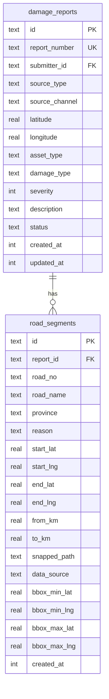

# feat: Move Hardcoded Road Damages to D1 Database

## Overview

Move the 90 hardcoded road segments from static TypeScript files to the D1 database and load them via API.

**Current State:**
- 90 road segments hardcoded in `src/react-app/data/initialRoadSegments.ts`
- 39,000 lines of pre-computed road paths in `src/react-app/data/snappedRoadPaths.ts` (557KB)
- Map component imports data directly (no API calls)
- Database tables `damage_reports` and `road_segments` exist but are empty

**Target State:**
- All road damage data stored in D1 database
- Frontend fetches data via API on load

## Problem Statement

1. **Data is static** - Cannot add/update road damages without code deployment
2. **Bundle size** - 557KB of path data bundled with frontend JavaScript
3. **No persistence** - New damage reports don't persist to database
4. **Schema mismatch** - Hardcoded data has fields not in database schema

## Technical Approach

```
┌─────────────┐     ┌──────────────┐     ┌─────────────┐
│   Browser   │────▶│ Cloudflare   │────▶│  D1 (SQLite)│
│  React App  │◀────│   Workers    │◀────│  Database   │
└─────────────┘     └──────────────┘     └─────────────┘
```

---

## Implementation Phases

### Phase 1: Schema Migration

Add missing columns to `road_segments` table to match hardcoded data structure.

#### 1.1 Create Migration File

**File:** `src/worker/db/migrations/0001_road_segment_fields.sql`

```sql
-- Add missing fields from hardcoded data
ALTER TABLE road_segments ADD COLUMN road_no TEXT;
ALTER TABLE road_segments ADD COLUMN from_km REAL;
ALTER TABLE road_segments ADD COLUMN to_km REAL;
ALTER TABLE road_segments ADD COLUMN reason TEXT;
ALTER TABLE road_segments ADD COLUMN data_source TEXT;
ALTER TABLE road_segments ADD COLUMN province TEXT;

-- Add bounding box columns for spatial queries
ALTER TABLE road_segments ADD COLUMN bbox_min_lat REAL;
ALTER TABLE road_segments ADD COLUMN bbox_min_lng REAL;
ALTER TABLE road_segments ADD COLUMN bbox_max_lat REAL;
ALTER TABLE road_segments ADD COLUMN bbox_max_lng REAL;

-- Create spatial index for viewport queries
CREATE INDEX idx_road_segments_bbox ON road_segments(bbox_min_lat, bbox_max_lat, bbox_min_lng, bbox_max_lng);

-- Create province index for filtering
CREATE INDEX idx_road_segments_province ON road_segments(province);
```

#### 1.2 Update Drizzle Schema

**File:** `src/worker/db/schema.ts` (modify roadSegments table)

```typescript
export const roadSegments = sqliteTable(
  "road_segments",
  {
    id: text("id").primaryKey(),
    reportId: text("report_id").references(() => damageReports.id),
    startLat: real("start_lat").notNull(),
    startLng: real("start_lng").notNull(),
    endLat: real("end_lat").notNull(),
    endLng: real("end_lng").notNull(),
    snappedPath: text("snapped_path"), // JSON array
    roadName: text("road_name"),
    // New fields
    roadNo: text("road_no"),
    fromKm: real("from_km"),
    toKm: real("to_km"),
    reason: text("reason"),
    dataSource: text("data_source"),
    province: text("province"),
    // Bounding box for spatial queries
    bboxMinLat: real("bbox_min_lat"),
    bboxMinLng: real("bbox_min_lng"),
    bboxMaxLat: real("bbox_max_lat"),
    bboxMaxLng: real("bbox_max_lng"),
    createdAt: integer("created_at", { mode: "timestamp" }).notNull(),
  },
  (table) => [
    index("road_segments_report_idx").on(table.reportId),
    index("idx_road_segments_bbox").on(table.bboxMinLat, table.bboxMaxLat),
    index("idx_road_segments_province").on(table.province),
  ]
);
```

---

### Phase 2: Data Migration Script

Create script to import hardcoded data into database.

#### 2.1 Migration Script

**File:** `scripts/migrate-road-segments.ts`

```typescript
import { initialRoadSegments, mapReasonToDamageType, mapReasonToSeverity } from "../src/react-app/data/initialRoadSegments";
import { snappedRoadPaths } from "../src/react-app/data/snappedRoadPaths";

interface MigrationSegment {
  id: string;
  reportId: string;
  roadNo: string;
  roadName: string;
  province: string;
  reason: string;
  damageType: string;
  severity: number;
  startLat: number;
  startLng: number;
  endLat: number;
  endLng: number;
  fromKm: number;
  toKm: number;
  snappedPath: [number, number][];
  bbox: { minLat: number; minLng: number; maxLat: number; maxLng: number };
}

function computeBoundingBox(path: [number, number][]): MigrationSegment["bbox"] {
  const lats = path.map(p => p[0]);
  const lngs = path.map(p => p[1]);
  return {
    minLat: Math.min(...lats),
    maxLat: Math.max(...lats),
    minLng: Math.min(...lngs),
    maxLng: Math.max(...lngs),
  };
}

export function prepareMigrationData(): MigrationSegment[] {
  return initialRoadSegments.map(seg => {
    const path = snappedRoadPaths[seg.id] || [[seg.fromLat, seg.fromLng], [seg.toLat, seg.toLng]];
    const bbox = computeBoundingBox(path);

    return {
      id: seg.id,
      reportId: `report-${seg.id}`, // Create linked report
      roadNo: seg.roadNo,
      roadName: seg.roadName,
      province: seg.province,
      reason: seg.reason,
      damageType: mapReasonToDamageType(seg.reason),
      severity: mapReasonToSeverity(seg.reason),
      startLat: seg.fromLat,
      startLng: seg.fromLng,
      endLat: seg.toLat,
      endLng: seg.toLng,
      fromKm: seg.fromKm,
      toKm: seg.toKm,
      snappedPath: path,
      bbox,
    };
  });
}
```

#### 2.2 Admin Import Endpoint

**File:** `src/worker/routes/admin.ts`

```typescript
import { Hono } from "hono";
import { authMiddleware, requireRole } from "../middleware/auth";
import { createDb } from "../db";
import { damageReports, roadSegments } from "../db/schema";
import { prepareMigrationData } from "../../scripts/migrate-road-segments";

const adminRoutes = new Hono<{ Bindings: Env }>();

// POST /api/v1/admin/import-segments
adminRoutes.post(
  "/import-segments",
  authMiddleware(),
  requireRole("admin", "super_admin"),
  async (c) => {
    const db = createDb(c.env.DB);
    const data = prepareMigrationData();
    const now = new Date();

    // Transaction: all or nothing
    try {
      for (const seg of data) {
        // Create damage report
        await db.insert(damageReports).values({
          id: seg.reportId,
          reportNumber: `IMPORT-${seg.id}`,
          sourceType: "other_agency",
          sourceChannel: "bulk_upload",
          latitude: seg.startLat,
          longitude: seg.startLng,
          assetType: "road",
          damageType: seg.damageType,
          severity: seg.severity,
          description: seg.reason,
          status: "verified",
          createdAt: now,
          updatedAt: now,
        });

        // Create road segment
        await db.insert(roadSegments).values({
          id: seg.id,
          reportId: seg.reportId,
          roadNo: seg.roadNo,
          roadName: seg.roadName,
          province: seg.province,
          reason: seg.reason,
          startLat: seg.startLat,
          startLng: seg.startLng,
          endLat: seg.endLat,
          endLng: seg.endLng,
          fromKm: seg.fromKm,
          toKm: seg.toKm,
          snappedPath: JSON.stringify(seg.snappedPath),
          dataSource: "initial_import",
          bboxMinLat: seg.bbox.minLat,
          bboxMinLng: seg.bbox.minLng,
          bboxMaxLat: seg.bbox.maxLat,
          bboxMaxLng: seg.bbox.maxLng,
          createdAt: now,
        });
      }

      // Invalidate cache
      await caches.default.delete(new Request(new URL("/api/v1/map/segments", c.req.url)));

      return c.json({ success: true, imported: data.length });
    } catch (error) {
      return c.json({ error: "Import failed", details: String(error) }, 500);
    }
  }
);

export { adminRoutes };
```

---

### Phase 3: API Endpoint

Update the existing map API to return segments from database.

**File:** `src/worker/routes/map.ts` (update GET /segments)

```typescript
// GET /api/v1/map/segments
mapRoutes.get("/segments", async (c) => {
  const db = createDb(c.env.DB);

  const results = await db
    .select({
      id: roadSegments.id,
      reportId: roadSegments.reportId,
      roadNo: roadSegments.roadNo,
      roadName: roadSegments.roadName,
      province: roadSegments.province,
      reason: roadSegments.reason,
      startLat: roadSegments.startLat,
      startLng: roadSegments.startLng,
      endLat: roadSegments.endLat,
      endLng: roadSegments.endLng,
      snappedPath: roadSegments.snappedPath,
      damageType: damageReports.damageType,
      severity: damageReports.severity,
      status: damageReports.status,
    })
    .from(roadSegments)
    .leftJoin(damageReports, eq(roadSegments.reportId, damageReports.id))
    .all();

  const segments = results.map((row) => ({
    id: row.id,
    reportId: row.reportId,
    roadNo: row.roadNo,
    roadName: row.roadName,
    province: row.province,
    reason: row.reason,
    path: row.snappedPath ? JSON.parse(row.snappedPath) : null,
    damageType: row.damageType,
    severity: row.severity,
    status: row.status,
  }));

  return c.json(segments);
});
```

---

### Phase 4: Frontend Integration

Replace hardcoded imports with API fetching.

#### 4.1 Custom Hook for Road Segments

**File:** `src/react-app/hooks/useRoadSegments.ts`

```typescript
import { useState, useEffect } from "react";

interface RoadSegment {
  id: string;
  roadNo: string;
  roadName: string;
  province: string;
  reason: string;
  path: [number, number][];
  damageType: string;
  severity: number;
  status: string;
}

export function useRoadSegments() {
  const [segments, setSegments] = useState<RoadSegment[]>([]);
  const [isLoading, setIsLoading] = useState(true);
  const [error, setError] = useState<string | null>(null);

  useEffect(() => {
    fetch("/api/v1/map/segments")
      .then((res) => {
        if (!res.ok) throw new Error("Failed to fetch segments");
        return res.json();
      })
      .then(setSegments)
      .catch((err) => setError(err.message))
      .finally(() => setIsLoading(false));
  }, []);

  return { segments, isLoading, error };
}
```

#### 4.2 Update DisasterMap Component

**File:** `src/react-app/components/map/DisasterMap.tsx` (modify)

```typescript
// Remove these imports:
// import { initialRoadSegments, ... } from "@/data/initialRoadSegments";
// import { snappedRoadPaths } from "@/data/snappedRoadPaths";

// Add:
import { useRoadSegments } from "@/hooks/useRoadSegments";

export function DisasterMap({ selectedProvince, onSegmentClick }: DisasterMapProps) {
  const { segments, isLoading, error } = useRoadSegments();

  // Filter by province if selected
  const visibleSegments = selectedProvince
    ? segments.filter((s) => s.province === selectedProvince)
    : segments;

  if (isLoading) {
    return <div className="h-full w-full bg-gray-100 animate-pulse" />;
  }

  if (error) {
    return <div className="h-full flex items-center justify-center text-red-500">{error}</div>;
  }

  return (
    <MapContainer ...>
      {/* Existing map content using visibleSegments */}
    </MapContainer>
  );
}
```

---

## Acceptance Criteria

### Functional Requirements

- [ ] All 90 existing road segments migrated to database
- [ ] Map loads segments from API instead of bundled files
- [ ] Segments display correctly with damage type and severity
- [ ] Province filtering works as before

### Non-Functional Requirements

- [ ] API response time under 500ms
- [ ] Bundle size reduced by ~500KB

### Quality Gates

- [ ] All existing map functionality preserved
- [ ] No data loss during migration
- [ ] Error states handled gracefully

---

## Files to Create/Modify

### New Files
| File | Purpose |
|------|---------|
| `src/worker/db/migrations/0001_road_segment_fields.sql` | Schema migration |
| `scripts/migrate-road-segments.ts` | Data migration script |
| `src/worker/routes/admin.ts` | Admin import endpoint |
| `src/react-app/hooks/useRoadSegments.ts` | Data fetching hook |

### Modified Files
| File | Changes |
|------|---------|
| `src/worker/db/schema.ts` | Add new columns to roadSegments |
| `src/worker/routes/map.ts` | Return segments from database |
| `src/worker/index.ts` | Mount admin routes |
| `src/react-app/components/map/DisasterMap.tsx` | Use API instead of imports |

### Deprecated Files (remove after migration)
| File | Reason |
|------|--------|
| `src/react-app/data/initialRoadSegments.ts` | Data now in DB |
| `src/react-app/data/snappedRoadPaths.ts` | Data now in DB |

---

## ERD: Updated Schema



---

## Success Metrics

| Metric | Current | Target |
|--------|---------|--------|
| Bundle size | 762KB | ~250KB |
| API response time | N/A | <500ms |

---

## References

### Internal
- `src/react-app/data/initialRoadSegments.ts` - Current hardcoded data structure
- `src/worker/routes/map.ts` - Existing GET /segments endpoint
- `src/worker/db/schema.ts` - Current road_segments schema

### External
- [Drizzle ORM D1](https://orm.drizzle.team/docs/get-started-d1)
