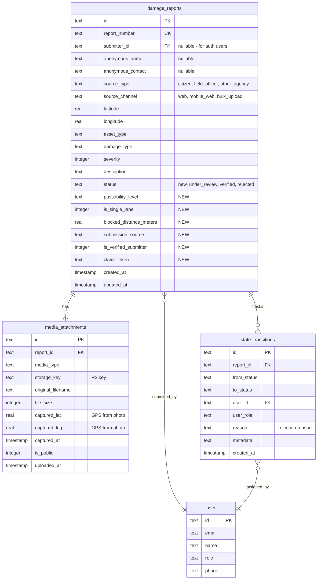

# Feature: Road Incident Report Submission System

## Overview

Enable citizens to report road incidents (tree falls, landslides, flooding, etc.) via mobile web. Anonymous submissions allowed but prompted for signup on submit. All reports go through admin approval before appearing on the public map.

## Problem Statement

Currently, road status information comes only from official RDA sources. Citizens witnessing incidents have no way to report them, leading to delayed awareness of road blockages. This feature enables crowd-sourced incident reporting with a verification workflow.

## Proposed Solution

A mobile-first submission form that:
1. Captures photo via camera (with GPS auto-detection)
2. Collects incident details (category, passability, distance)
3. Works for anonymous users with auth prompt on submit
4. Routes all submissions through admin approval queue
5. Shows approved reports on the public map

---

## Technical Approach

### Database Schema Extensions

**New fields for `damageReports` table:**

```typescript
// src/worker/db/schema.ts - additions to damageReports

// Passability tracking
passabilityLevel: text("passability_level"), // unpassable|foot|bike|3wheeler|car|bus|truck
isSingleLane: integer("is_single_lane", { mode: "boolean" }).default(false),
blockedDistanceMeters: real("blocked_distance_meters"),

// Submission metadata
submissionSource: text("submission_source"), // citizen_web, citizen_mobile, official
isVerifiedSubmitter: integer("is_verified_submitter", { mode: "boolean" }).default(false),
claimToken: text("claim_token"), // For anonymous users to claim reports later
```

**Update DamageType enum in `src/shared/types.ts`:**

```typescript
export const DamageType = {
  TREE_FALL: "tree_fall",
  BRIDGE_COLLAPSE: "bridge_collapse",
  LANDSLIDE: "landslide",
  FLOODING: "flooding",
  ROAD_BREAKAGE: "road_breakage",
  WASHOUT: "washout",
  COLLAPSE: "collapse",
  BLOCKAGE: "blockage",
  OTHER: "other",
} as const;

export const PassabilityLevel = {
  UNPASSABLE: "unpassable",
  FOOT: "foot",
  BIKE: "bike",
  THREE_WHEELER: "3wheeler",
  CAR: "car",
  BUS: "bus",
  TRUCK: "truck",
} as const;
```

### ERD for New/Modified Tables



---

## Implementation Phases

### Phase 1: Backend API & Schema

**Files to create/modify:**

1. `src/worker/db/schema.ts` - Add new columns to damageReports
2. `src/worker/db/migrations/0002_add_citizen_report_fields.sql` - Migration
3. `src/shared/types.ts` - Add PassabilityLevel, update DamageType
4. `src/worker/routes/reports.ts` - New reports API routes
5. `src/worker/services/mediaService.ts` - R2 upload service

**API Endpoints:**

```typescript
// POST /api/v1/reports - Create new report (anonymous or authenticated)
// GET /api/v1/reports - Get user's own reports (authenticated)
// GET /api/v1/reports/area - Get approved reports by location bounds
// POST /api/v1/reports/:id/claim - Claim anonymous report after signup
```

**Report Creation Endpoint:**

```typescript
// src/worker/routes/reports.ts

import { Hono } from "hono";
import { zValidator } from "@hono/zod-validator";
import { z } from "zod";
import { optionalAuthMiddleware } from "../middleware/auth";

const createReportSchema = z.object({
  // Required
  latitude: z.number().min(-90).max(90),
  longitude: z.number().min(-90).max(90),
  damageType: z.enum(["tree_fall", "bridge_collapse", "landslide", "flooding", "road_breakage", "other"]),

  // Optional
  anonymousName: z.string().max(100).optional(),
  anonymousContact: z.string().max(50).optional(), // phone
  description: z.string().max(1000).optional(),
  passabilityLevel: z.enum(["unpassable", "foot", "bike", "3wheeler", "car", "bus", "truck"]).optional(),
  isSingleLane: z.boolean().optional(),
  blockedDistanceMeters: z.number().min(0).max(10000).optional(),
});

reportsRoutes.post("/",
  optionalAuthMiddleware(),
  zValidator("json", createReportSchema),
  async (c) => {
    const auth = c.get("auth");
    const data = c.req.valid("json");

    // Generate claim token for anonymous users
    const claimToken = !auth ? crypto.randomUUID() : null;

    // Create report with status="new"
    const report = await createDamageReport({
      ...data,
      submitterId: auth?.userId || null,
      isVerifiedSubmitter: !!auth,
      submissionSource: "citizen_mobile",
      status: "new",
      claimToken,
    });

    return c.json({
      id: report.id,
      claimToken, // Return to client for later claiming
      promptSignup: !auth,
    });
  }
);
```

### Phase 2: Photo Capture & Upload

**Files to create:**

1. `src/react-app/components/camera/CameraCapture.tsx` - Camera component
2. `src/react-app/components/camera/PhotoGallery.tsx` - Multi-photo gallery
3. `src/react-app/hooks/useCamera.ts` - Camera hook
4. `src/react-app/hooks/useGeolocation.ts` - GPS hook
5. `src/worker/routes/upload.ts` - Upload endpoint

**Camera Capture Component:**

```typescript
// src/react-app/components/camera/CameraCapture.tsx

interface CameraCaptureProps {
  onCapture: (file: File, coords: { lat: number; lng: number } | null) => void;
  onError: (error: string) => void;
  maxPhotos?: number; // Default: 5
  currentCount: number;
}

export function CameraCapture({ onCapture, onError, maxPhotos = 5, currentCount }: CameraCaptureProps) {
  // Use back camera (environment) for incident photos
  // Capture GPS at moment of photo (use first photo's GPS as primary)
  // Return compressed JPEG (max 1920px, 80% quality)
  // Disable capture button when currentCount >= maxPhotos
}
```

**Photo Gallery Component:**

```typescript
// src/react-app/components/camera/PhotoGallery.tsx

interface Photo {
  id: string;
  file: File;
  preview: string;
  coords: { lat: number; lng: number } | null;
}

interface PhotoGalleryProps {
  photos: Photo[];
  onRemove: (id: string) => void;
  maxPhotos: number;
}

export function PhotoGallery({ photos, onRemove, maxPhotos }: PhotoGalleryProps) {
  // Grid of photo thumbnails (2x3 grid on mobile)
  // Remove button on each photo
  // "X of 5 photos" counter
  // First photo marked as "Primary" (GPS source)
}
```

**Upload Flow:**

```typescript
// 1. Client captures up to 5 photos with GPS
// 2. Client compresses each image (Compressor.js)
// 3. POST /api/v1/upload/photos with FormData (multipart)
// 4. Server stores each in R2 with key: reports/{reportId}/{uuid}.jpg
// 5. Server creates mediaAttachment record for each with GPS coords
// 6. First photo's GPS used as report location (primary)
// 7. Return array of storage keys to client
```

### Phase 3: Submission Form UI

**Files to create:**

1. `src/react-app/pages/ReportIncident.tsx` - Main form page
2. `src/react-app/components/forms/PassabilityScale.tsx` - Passability selector
3. `src/react-app/components/forms/IncidentCategorySelect.tsx` - Category picker
4. `src/react-app/stores/incidentReport.ts` - Form state store

**Form Structure (Progressive Disclosure):**

```
Step 1: Photo Capture (REQUIRED - at least 1, up to 5)
├── Camera viewfinder
├── Capture button
├── Photo gallery (thumbnails of captured photos)
├── GPS indicator (auto-captured from first photo)
├── Remove/retake individual photos
└── "Add more photos" button (until 5 reached)

Step 2: Incident Details
├── Category selector (REQUIRED) - visual icons
├── Passability scale (OPTIONAL) - sliding selector
├── Single lane toggle (OPTIONAL)
└── Blocked distance (OPTIONAL) - number input

Step 3: Contact Info (OPTIONAL)
├── Name input
├── Phone input
└── Description textarea

Step 4: Review & Submit
├── Photo preview with GPS marker on mini-map
├── Summary of details
└── Submit button → Auth prompt if anonymous
```

**Required vs Optional Fields:**

| Field | Required | Notes |
|-------|----------|-------|
| Photos | YES (1-5) | Must capture, no upload for anonymous. Max 5 photos. |
| GPS | YES | Auto-captured from first photo |
| Category | YES | Single select |
| Passability | NO | Default: unpassable |
| Single Lane | NO | Default: false |
| Blocked Distance | NO | Default: null |
| Name | NO | Pre-filled if logged in |
| Phone | NO | Pre-filled if logged in |
| Description | NO | Free text |

### Phase 4: Auth Integration

**Post-Submit Auth Flow:**

```
Submit Report
    ↓
[Report Created with status="new", claimToken generated]
    ↓
Show Success Modal with Options:
├── "Sign up to track your report" → Register page (with claimToken in state)
├── "Login to link report" → Login page (with claimToken in state)
└── "Continue without account" → Show claimToken for later use
    ↓
If user signs up/logs in:
├── POST /api/v1/reports/:id/claim with claimToken
├── Report.submitterId = user.id
└── Report.isVerifiedSubmitter = true
```

**Claim Report Endpoint:**

```typescript
// POST /api/v1/reports/:id/claim
reportsRoutes.post("/:id/claim",
  authMiddleware(),
  async (c) => {
    const { id } = c.req.param();
    const { claimToken } = await c.req.json();
    const auth = c.get("auth");

    const report = await getReportByIdAndToken(id, claimToken);
    if (!report) {
      return c.json({ error: "Invalid claim token" }, 400);
    }

    await updateReport(id, {
      submitterId: auth.userId,
      isVerifiedSubmitter: true,
      claimToken: null, // Clear after claiming
    });

    return c.json({ success: true });
  }
);
```

### Phase 5: Map Integration

**Show Approved Reports on Map:**

```typescript
// src/worker/routes/map.ts - Update existing segments endpoint

// GET /api/v1/map/incidents - Get approved citizen reports
mapRoutes.get("/incidents", async (c) => {
  const db = createDb(c.env.DB);

  const reports = await db
    .select()
    .from(damageReports)
    .where(eq(damageReports.status, "verified"))
    .where(eq(damageReports.sourceType, "citizen"));

  return c.json(reports);
});
```

**Map Display:**

- Different markers for citizen reports vs official RDA data
- Click marker → Show incident details popup
- Filter toggle: Show/hide citizen reports

---

## Acceptance Criteria

### Functional Requirements

- [ ] Anonymous user can capture photo and submit incident report
- [ ] GPS location is auto-captured when photo is taken
- [ ] User can select incident category from visual picker
- [ ] User can optionally specify passability level
- [ ] User can optionally provide contact info (name, phone)
- [ ] On submit, anonymous users see signup/login prompt
- [ ] Claim token allows linking report to account later
- [ ] All submissions start with status="new"
- [ ] Only "verified" reports appear on public map
- [ ] Authenticated users can view their submitted reports

### Non-Functional Requirements

- [ ] Photo compression to max 500KB before upload
- [ ] Form works offline (queue submission when online)
- [ ] Rate limiting: 5 anonymous/hour, 20 authenticated/hour
- [ ] GPS accuracy indicator shown to user
- [ ] Form state persisted in Zustand (survives page refresh)

### Error Handling

- [ ] Camera permission denied → Show explanation + settings link
- [ ] GPS unavailable → Allow manual pin drop on map
- [ ] Upload fails → Retry with exponential backoff
- [ ] Rate limit hit → Show countdown timer

---

## File Structure

```
src/
├── react-app/
│   ├── pages/
│   │   └── ReportIncident.tsx          # Main form page
│   ├── components/
│   │   ├── camera/
│   │   │   └── CameraCapture.tsx       # Camera capture component
│   │   └── forms/
│   │       ├── PassabilityScale.tsx    # Passability selector
│   │       ├── IncidentCategorySelect.tsx
│   │       └── AuthPromptModal.tsx     # Post-submit auth prompt
│   ├── hooks/
│   │   ├── useCamera.ts
│   │   └── useGeolocation.ts
│   └── stores/
│       └── incidentReport.ts           # Form state
├── worker/
│   ├── routes/
│   │   ├── reports.ts                  # Report CRUD endpoints
│   │   └── upload.ts                   # Photo upload endpoint
│   ├── services/
│   │   └── mediaService.ts             # R2 operations
│   └── db/
│       └── migrations/
│           └── 0002_add_citizen_report_fields.sql
└── shared/
    └── types.ts                        # Updated enums
```

---

## Out of Scope (Future Tasks)

- Admin approval queue UI (separate plan)
- Email notifications on approval/rejection
- SMS notifications
- Duplicate report detection
- Photo content moderation
- Desktop photo upload for official users
- Report editing after submission
- Report withdrawal/deletion

---

## Questions Resolved

| Question | Decision |
|----------|----------|
| Required fields? | At least 1 photo, GPS, Category only |
| Camera failure? | Show error, suggest retry, link to settings |
| GPS failure? | Allow manual pin drop as fallback |
| Passability scale UI? | Radio buttons in order (not slider) |
| Multiple photos? | Yes, 1-5 photos per submission. First photo's GPS used as primary location. |
| Desktop users? | Mobile-only for anonymous, desktop allowed for authenticated users |
| Offline support? | Yes, queue in Zustand, sync when online |

---

## References

### Internal Files
- Schema: `src/worker/db/schema.ts:37-85` (damageReports)
- Media attachments: `src/worker/db/schema.ts:88-108`
- State transitions: `src/worker/db/schema.ts:111-131`
- Auth middleware: `src/worker/middleware/auth.ts:54-75` (optionalAuthMiddleware)
- Existing form: `src/react-app/pages/SubmitReport.tsx`
- R2 config: `wrangler.json:23-28`
- Upload limits: `src/shared/constants.ts:26-34`
- Rate limits: `src/shared/constants.ts:42-47`

### External Documentation
- [MDN: getUserMedia](https://developer.mozilla.org/en-US/docs/Web/API/MediaDevices/getUserMedia)
- [MDN: Geolocation API](https://developer.mozilla.org/en-US/docs/Web/API/Geolocation_API)
- [Cloudflare R2 Workers](https://developers.cloudflare.com/r2/api/workers/)
- [Compressor.js](https://fengyuanchen.github.io/compressorjs/)
- [Better Auth Anonymous Plugin](https://www.better-auth.com/docs/plugins/anonymous)
